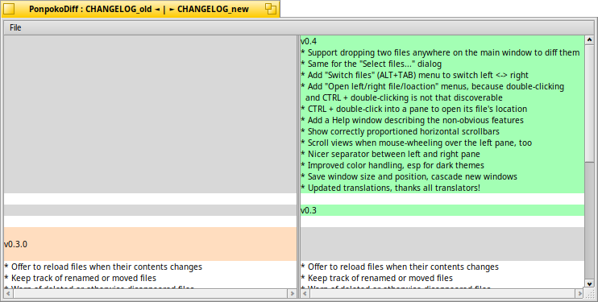

# PonpokoDiff

A tool to graphically compare text files.

* Yellow indicates changed lines.
* Red indicates removed lines.
* Green indicates added lines.

Double-click to open the left/right file with its preferred application. Hold CTRL while double-clicking to show the left/right file's location in Tracker.

PonpokoDiff automatically keeps track of renamed and moved files and offers to reload files when their contents has changed.

Please help out with translations at [Polyglot](https://i18n.kacperkasper.pl/projects/49).
